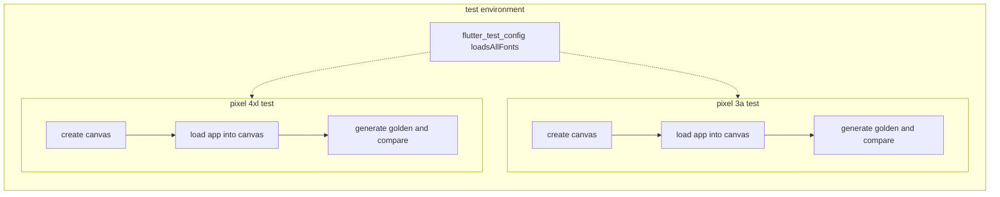

We wanted to verify our layout behavior across various screen widths, especially across layout change boundaries. Ex: Change field sizes, expose menus, or make other items at higher widths.

Mobile devices have high-resolution screens that are logically down-scaled for sizing display widgets essentially using a logical resolution. I ended up writing this simple MediaQuery program that tells me the effective size of the screen of a device. This lets us build a library of test device resolutions and aspect ratios. We can run the same test across as many devices as we wish because computing is cheaper than manual testers.

Flutter golden image tests are a simple way to watch for layout regression.  They compare a stored image against a new image captured during test execution.  The base behavior is that they open an 800x600 canvas and use that.   We can change the size of the test canvas where the golden test images are rendered.

What if we want to work in the opposite direction starting with various phones and their geometries? I thought we'd just set the resolution to the phone screen size but it turned out to be very wrong wrong. You have to set the test canvas to the Flutter logical screen resolution.

# Device Media Query Examples
In general, the web is just 1:1 physical to logical.  We can set the test screen size to the target canvas size.  Mobile device test resolution should be sized to the logical MediaQuery width and height.  We don't care how big the test canvas is physically.  We care about the test canvas size as drawn by Flutter.

| Device | Pixels (w) | Pixels (h) | Diagonal | PPI | MQ width | MQ height |  Device Pixel Ratio | Eff PPI
| - | - | - | - | - | - | - | - | - |
| web | 500 | 430 | n/a | 96 @100% |  500 | 430 | 1 | 96 |
| Pixel 3a | 1080 | 2220 | 5.6" | 441 |  392.7 |  783.3 | 2.75 | 160 |

 Here we can see that the 1080x2220 pixel display is treated as a 392/783 sized canvas.  This means we should size the golden test to 392x783 if we want to detect out-of-bounds drawing or layout issues.

# References
| | |
| - | - |
| Blog | [Better Flutter golden testing - how mobile logical sizing is different than the default golden size](https://joe.blog.freemansoft.com/2023/08/better-golden-testing-understanding.html) |
| Blog | [Flutter golden testing - generating tester views sized to your mobile devices](https://joe.blog.freemansoft.com/2023/08/flutter-golden-testing-generating.html) |
| | |
| Video | [Flutter Golden testing with views sized to your mobile devices](https://youtu.be/9hBxgvLfAg8) |
| Video | [Flutter golden testing - taking into account the Flutter logical resolution on mobile devices](https://youtu.be/75_VfkX2XWI) |
| | |
| Demonstration Code | [Flutter media query example with tests](https://github.com/freemansoft/flutter_media_query) |

# Test Flow

